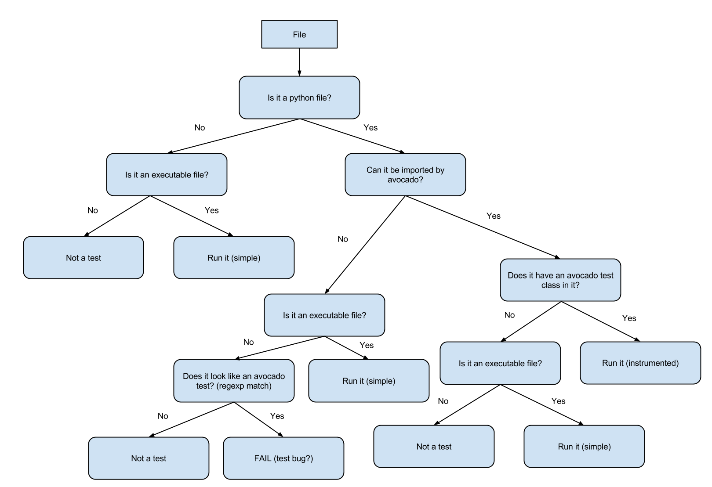

.. _reference-guide:

===============
Reference Guide
===============

This guide presents information on the Avocado basic design and its internals.

Job, test and identifiers
=========================

.. _job-id:

Job ID
------

The Job ID is a random SHA1 string that uniquely identifies a given job.

The full form of the SHA1 string is used is most references to a job::

  $ avocado run sleeptest.py
  JOB ID     : 49ec339a6cca73397be21866453985f88713ac34
  ...

But a shorter version is also used at some places, such as in the job
results location::

  JOB LOG    : $HOME/avocado/job-results/job-2015-06-10T10.44-49ec339/job.log


Test References
---------------

A Test Reference is a string that can be resolved into
(interpreted as) one or more tests by the Avocado Test Resolver.
A given resolver plugin is free to interpret a test reference,
it is completely abstract to the other components of Avocado.

.. note:: Mapping the Test References to tests can be affected
   by command-line switches like `--external-runner`, which
   completelly changes the meaning of the given strings.


Test Name
---------

A test name is an arbitrarily long string that unambiguously
points to the source of a single test. In other words the Avocado
Test Resolver, as configured for a particular job, should return
one and only one test as the interpretation of this name.

This name can be as specific as necessary to make it unique.
Therefore it can contain an arbitrary number of variables,
prefixes, suffixes, tags, etc.  It all depends on user
preferences, what is supported by Avocado via its Test Resolvers and
the context of the job.

The output of the Test Resolver when resolving Test References
should always be a list of unambiguous Test Names (for that
particular job).

Notice that although the Test Name has to be unique, one test can
be run more than once inside a job.

By definition, a Test Name is a Test Reference, but the
reciprocal is not necessarily true, as the latter can represent
more than one test.


Variant IDs
-----------

The multiplexer component creates different sets of variables
(known as "variants"), to allow tests to be run individually in
each of them.

A Variant ID is an arbitrary and abstract string created by the
multiplexer to identify each variant. It should be unique per
variant inside a set. In other words, the multiplexer generates a
set of variants, identified by unique IDs.

A simpler implementation of the multiplexer uses serial integers
as Variant IDs. A more sophisticated implementation could
generate Variant IDs with more semantic, potentially representing
their contents.

.. note:: The multiplexer supports serialized variant IDs only


Test ID
--------

A test ID is a string that uniquely identifies a test in the
context of a job. When considering a single job, there are no two
tests with the same ID.

A test ID should encapsulate the Test Name and the Variant ID, to
allow direct identification of a test. In other words, by looking
at the test ID it should be possible to identify:

  - What's the test name
  - What's the variant used to run this test (if any)

Test IDs don't necessarily keep their uniqueness properties when
considered outside of a particular job, but two identical jobs
run in the exact same environment should generate a identical
sets of Test IDs.

Syntax::

   <unique-id>-<test-name>[;<variant-id>]

Examples of test-names::

   '/bin/true'
   '/bin/grep foobar /etc/passwd'
   'passtest.py:Passtest.test'
   'file:///tmp/passtest.py:Passtest.test'
   'multiple_tests.py:MultipleTests.test_hello'
   'type_specific.io-github-autotest-qemu.systemtap_tracing.qemu.qemu_free'


.. _test-types:

Test Types
==========

Avocado at its simplest configuration can run two different types of tests [#f1]_. You can mix
and match those in a single job.

Instrumented
------------

These are tests written in Python or BASH with the Avocado helpers that use the Avocado test API.

To be more precise, the Python file must contain a class derived from :mod:`avocado.test.Test`.
This means that an executable written in Python is not always an instrumented test, but may work
as a simple test.

The instrumented tests allows the writer finer control over the process
including logging, test result status and other more sophisticated test APIs.

Test statuses ``PASS``, ``WARN``, ``START`` and ``SKIP`` are considered as
successful builds. The ``ABORT``, ``ERROR``, ``FAIL``, ``ALERT``, ``RUNNING``,
``NOSTATUS`` and ``INTERRUPTED`` are considered as failed ones.

Simple
------

Any executable in your box. The criteria for PASS/FAIL is the return code of the executable.
If it returns 0, the test PASSes, if it returns anything else, it FAILs.

Test Statuses
=============

Avocado sticks to the following definitions of test statuses:

 * ```PASS```: The test passed, which means all conditions being tested have passed.
 * ```FAIL```: The test failed, which means at least one condition being tested has
   failed. Ideally, it should mean a problem in the software being tested has been found.
 * ```ERROR```: An error happened during the test execution. This can happen, for example,
   if there's a bug in the test runner, in its libraries or if a resource breaks unexpectedly.
   Uncaught exceptions in the test code will also result in this status.
 * ```SKIP```: The test runner decided a requested test should not be run. This
   can happen, for example, due to missing requirements in the test environment
   or when there's a job timeout.

.. _libraries-apis:

Libraries and APIs
==================

The Avocado libraries and its APIs are a big part of what Avocado is.

But, to avoid having any issues you should understand what parts of the Avocado
libraries are intended for test writers and their respective API stability promises.

Test APIs
---------

At the most basic level there's the Test APIs which you should use when writing
tests in Python and planning to make use of any other utility library.

The Test APIs can be found in the :mod:`avocado` main module, and its most important
member is the :class:`avocado.Test` class. By conforming to the :class:`avocado.Test`
API, that is, by inheriting from it, you can use the full set of utility libraries.

The Test APIs are guaranteed to be stable across a single major version of Avocado.
That means that a test written for a given version of Avocado should not break on later
minor versions because of Test API changes.

Utility Libraries
-----------------

There are also a large number of utility libraries that can be found under the
:mod:`avocado.utils` namespace. These are very general in nature and can help you
speed up your test development.

The utility libraries may receive incompatible changes across minor versions, but
these will be done in a staged fashion. If a given change to an utility library
can cause test breakage, it will first be documented and/or deprecated, and only
on the next subsequent minor version it will actually be changed.

What this means is that upon updating to later minor versions of Avocado, you
should look at the Avocado Release Notes for changes that may impact your tests.

Core (Application) Libraries
----------------------------

Finally, everything under :mod:`avocado.core` is part of the application's
infrastructure and should not be used by tests.

Extensions and Plugins can use the core libraries, but API stability is not
guaranteed at any level.

Test Resolution
===============

When you use the Avocado runner, frequently you'll provide paths to files,
that will be inspected, and acted upon depending on their contents. The
diagram below shows how Avocado analyzes a file and decides what to do with
it:



It's important to note that the inspection mechanism is safe (that is, python
classes and files are not actually loaded and executed on discovery and
inspection stage). Due to the fact Avocado doesn't actually load the code
and classes, the introspection is simple and will *not* catch things like
buggy test modules, missing imports and miscellaneous bugs in the code you
want to list or run. We recommend only running tests from sources you trust,
use of static checking and reviews in your test development process.

Due to the simple test inspection mechanism, avocado will not recognize test
classes that inherit from a class derived from :class:`avocado.Test`. Please
refer to the :doc:`WritingTests` documentation on how to use the tags functionality
to mark derived classes as avocado test classes.

Results Specification
=====================

On a machine that executed tests, job results are available under
``[job-results]/job-[timestamp]-[short job ID]``, where ``logdir`` is the configured Avocado
logs directory (see the data dir plugin), and the directory name includes
a timestamp, such as ``job-2014-08-12T15.44-565e8de``. A typical
results directory structure can be seen below ::

    $HOME/avocado/job-results/job-2014-08-13T00.45-4a92bc0/
    ├── id
    ├── job.log
    ├── results.json
    ├── results.xml
    ├── sysinfo
    │   ├── post
    │   │   ├── brctl_show
    │   │   ├── cmdline
    │   │   ├── cpuinfo
    │   │   ├── current_clocksource
    │   │   ├── df_-mP
    │   │   ├── dmesg_-c
    │   │   ├── dmidecode
    │   │   ├── fdisk_-l
    │   │   ├── gcc_--version
    │   │   ├── hostname
    │   │   ├── ifconfig_-a
    │   │   ├── interrupts
    │   │   ├── ip_link
    │   │   ├── ld_--version
    │   │   ├── lscpu
    │   │   ├── lspci_-vvnn
    │   │   ├── meminfo
    │   │   ├── modules
    │   │   ├── mount
    │   │   ├── mounts
    │   │   ├── numactl_--hardware_show
    │   │   ├── partitions
    │   │   ├── scaling_governor
    │   │   ├── uname_-a
    │   │   ├── uptime
    │   │   └── version
    │   ├── pre
    │   │   ├── brctl_show
    │   │   ├── cmdline
    │   │   ├── cpuinfo
    │   │   ├── current_clocksource
    │   │   ├── df_-mP
    │   │   ├── dmesg_-c
    │   │   ├── dmidecode
    │   │   ├── fdisk_-l
    │   │   ├── gcc_--version
    │   │   ├── hostname
    │   │   ├── ifconfig_-a
    │   │   ├── interrupts
    │   │   ├── ip_link
    │   │   ├── ld_--version
    │   │   ├── lscpu
    │   │   ├── lspci_-vvnn
    │   │   ├── meminfo
    │   │   ├── modules
    │   │   ├── mount
    │   │   ├── mounts
    │   │   ├── numactl_--hardware_show
    │   │   ├── partitions
    │   │   ├── scaling_governor
    │   │   ├── uname_-a
    │   │   ├── uptime
    │   │   └── version
    │   └── profile
    └── test-results
        └── tests
            ├── sleeptest.py.1
            │   ├── data
            │   ├── debug.log
            │   └── sysinfo
            │       ├── post
            │       └── pre
            ├── sleeptest.py.2
            │   ├── data
            │   ├── debug.log
            │   └── sysinfo
            │       ├── post
            │       └── pre
            └── sleeptest.py.3
                ├── data
                ├── debug.log
                └── sysinfo
                    ├── post
                    └── pre
    
    21 directories, 59 files


From what you can see, the results dir has:

1) A human readable ``id`` in the top level, with the job SHA1.
2) A human readable ``job.log`` in the top level, with human readable logs of
   the task
3) A machine readable ``results.xml`` and ``results.json`` in the top level,
   with a summary of the job information in xUnit/json format.
4) A top level ``sysinfo`` dir, with sub directories ``pre``, ``post`` and
   ``profile``, that store sysinfo files pre/post/during job, respectively.
5) Subdirectory ``test-results``, that contains a number of subdirectories
   (filesystem-friendly test ids). Those test ids represent instances of test
   execution results.

Test execution instances specification
--------------------------------------

The instances should have:

1) A top level human readable ``job.log``, with job debug information
2) A ``sysinfo`` subdir, with sub directories ``pre`` and ``post``, that store
   sysinfo files pre test and post test, respectively.
3) A ``data`` subdir, where the test can output a number of files if necessary.

.. [#f1] Avocado plugins can introduce additional test types.

Job Pre and Post Scripts
========================

Avocado ships with a plugin (installed by default) that allows running
scripts before and after the actual execution of Jobs.  A user can be
sure that, when a given "pre" script is run, no test in that job has
been run, and when the "post" scripts are run, all the tests in a
given job have already finished running.

Configuration
-------------

By default, the script directory location is::

  /etc/avocado/scripts/job

Inside that directory, that is a directory for pre-job scripts::

  /etc/avocado/scripts/job/pre.d

And for post-job scripts::

  /etc/avocado/scripts/job/post.d

All the configuration about the Pre/Post Job Scripts are placed under
the ``avocado.plugins.jobscripts`` config section.  To change the
location for the pre-job scripts, your configuration should look
something like this::

  [plugins.jobscripts]
  pre = /my/custom/directory/for/pre/job/scripts/

Accordingly, to change the location for the post-job scripts, your
configuration should look something like this::

  [plugins.jobscripts]
  post = /my/custom/directory/for/post/scripts/

A couple of other configuration options are available under the same
section:

* ``warn_non_existing_dir``: gives warnings if the configured (or
  default) directory set for either pre or post scripts do not exist
* ``warn_non_zero_status``: gives warnings if a given script (either
  pre or post) exits with non-zero status

Script Execution Environment
----------------------------

All scripts are run in separate process with some environment
variables set.  These can be used in your scripts in any way you wish:

* ``AVOCADO_JOB_UNIQUE_ID``: the unique `job-id`_.
* ``AVOCADO_JOB_STATUS``: the current status of the job.
* ``AVOCADO_JOB_LOGDIR``: the filesystem location that holds the logs
  and various other files for a given job run.

Note: Even though these variables should all be set, it's a good
practice for scripts to check if they're set before using their
values.  This may prevent unintended actions such as writing to the
current working directory instead of to the ``AVOCADO_JOB_LOGDIR`` if
this is not set.

Finally, any failures in the Pre/Post scripts will not alter the
status of the corresponding jobs.

Job Cleanup
===========

It's possible to register a callback function that will be called when
all the tests have finished running. This effectively allows for a
test job to clean some state it may have left behind.

At the moment, this feature is not intended to be used by test writers,
but it's seen as a feature for Avocado extensions to make use.

To register a callback function, your code should put a message in a
very specific format in the "runner queue". The Avocado test runner
code will understand that this message contains a (serialized) function
that will be called once all tests finish running.

Example::

  from avocado import Test

  def my_cleanup(path_to_file):
     if os.path.exists(path_to_file):
        os.unlink(path_to_file)

  class MyCustomTest(Test):
  ...
     cleanup_file = '/tmp/my-custom-state'
     self.runner_queue.put({"func_at_exit": self.my_cleanup,
                            "args": (cleanup_file),
                            "once": True})
  ...

This results in the ``my_cleanup`` function being called with
positional argument ``cleanup_file``.

Because ``once`` was set to ``True``, only one unique combination of
function, positional arguments and keyword arguments will be
registered, not matter how many times they're attempted to be
registered. For more information check
:meth:`avocado.utils.data_structures.CallbackRegister.register`.
