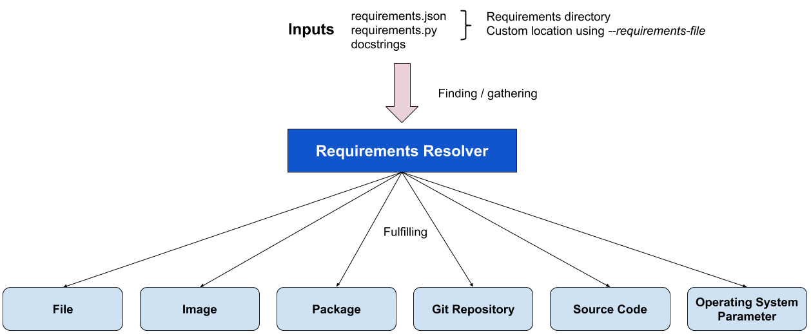

BP002
#####

:Number: BP002
:Title: Requirements resolver
:Author: Willian Rampazzo <willianr@redhat.com>
:Discussions-To: https://github.com/avocado-framework/avocado/issues/3455
:Reviewers: Beraldo Leal, Cleber Rosa
:Created: 27-Jan-2020
:Type: Architecture Blueprint
:Status: Approved

.. contents:: Table of Contents

TL;DR
*****

The current management of test assets is handled manually by the test
developer. It is usual to have a set of repetitive code blocks to define the
name, location, and other attributes of an asset, download it or signal an
error condition if a problem occurred and the download failed.

Based on use cases compiled from the discussion on qemu-devel mailing-list [1]
and discussions during Avocado meetings, this blueprint describes the
architecture of a requirements resolver aiming the extensibility and
flexibility when handling different types of assets, like a file, a cloud
image, a package, a Git repository, source codes or Operating System parameters.

Motivation
**********

Implementing a test that gathers its requirements while executing may lead to a
wrong interpretation of the test results if a requirement is not satisfied. The
failure of a test because of a missing requirement does not mean the test
itself failed. During its execution, the test has never reached the core test
code; still, it may be considered a failing test.

Fulfilling all the test requirements beforehand can be an efficient way to
handle requirements problems and can improve the trustworthiness of the test
result. It means that if a test ran and failed, the code responsible for the
failure is related to the core test and not with one of its requirements.

Regardless of how the test defines a requirement, an architecture capable of
identifying them is beneficial. Storing its references and delegating to the
code responsible for handling each different type of requirement makes the
overall architecture of Avocado and the requirement definition of a test more
flexible.

A requirements resolver can bring the necessary flexibility to the Avocado
architecture, as well as managing support for different types of requirements.

This blueprint discusses the architecture of a requirements resolver
responsible for handling the different requirements types.

Specification
*************

Basics
======

The strict meaning of a resolver is related to something responsible for
creating resolutions from a given representation. When there is a well-defined
way to declare something, a resolver can translate this representation to
another well-defined representation. The classic example is a Domain Name
Server (DNS), which resolves the hostname into an Internet Protocol (IP)
address. The use of the word `resolver` in this text means a code responsible
for gathering and fulfilling well-know representations with little or no
transformation.

The definition of requirements resolver in this blueprint is a code responsible
for gathering well-known formats of requirements, possibly from different
sources, and centralizing in one place, or fulfilling them. The requirements
fulfillment can take place starting from the centralized collection of
requirements as input to one of several modules responsible for handling each
specific type of requirement, like, for example, files, images, packages, git
repositories, source code or operating system parameters.

The following diagram shows the underlying architecture of a requirements
resolver proposed in this blueprint. The next sessions describes, in detail,
each part of the resolver, its inputs, and outputs.

Requirements representations
============================

Define how to represent a requirement is the first step to define the
architecture of a resolver. This blueprint defines the following ways to
represent a requirement:

  1. JavaScript Object Notation (JSON) file;
  2. Python executable that produces a JSON file;
  3. Metadata included in the test docstring.

Requirements representation as JSON files
-----------------------------------------

JSON is a lightweight data-interchange format [2] supported by the Python
standard library. Using it to represent requirements is flexible and
straightforward.

The standard proposed way to represent requirements with JSON is defining one
requirement per entry. Each entry should start with the requirement type,
followed by other keyword arguments related to that type. Example::

        [
            {"type": "file", "uri": "https://cabort.com/cabort.c", "hash": "deadbeefdeadbeef"},
            {"type": "vmimage", "distro": "fedora", "version": 31, "arch": "x86_64"},
            {"type": "package", "package": "lvm"}
        ]

The requirement `type` should match the module responsible for that type of
requirement.

Requirements representation as Python executable
------------------------------------------------

Another way to create the requirements representation as JSON files is by
writing a Python executable. This approach makes the requirements
representation flexible, by allowing the use of Python variables and code that
may change the parameters values for the requirements, depending on the
environment the Python code runs.

The following example shows a requirement that depends on the architecture
the test is running::

        #!/usr/bin/python3

        import os
        import json

        requirements = [
            {"type": "file", "uri": "https://cabort.com/cabort.c", "hash": "deadbeefdeadbeef"},
            {"type": "vmimage", "distro": "fedora", "version": 31, "arch": os.uname()[4]},
            {"type": "package", "package": "lvm"}
        ]

        print(json.dumps(requirements))

Requirements representation as Metadata on test docstring
---------------------------------------------------------

Test writers may want to add the requirements of a test into de test code. The
option proposed here allows the use of metadata on test docstrings to represent
the requirements list.

Below is an example of how to define requirements as metadata on docstrings::

        def test_something(self):
        '''
            :avocado: requirement={"type": "file", "uri": "https://cabort.com/cabort.c", "hash": "deadbeefdeadbeef"}
            :avocado: requirement={"type": "vmimage", "distro": "fedora", "version": 31, "arch": "x86_64"}
            :avocado requirement={"type": "package", "package": "lvm"}
        '''
           <test code>

Requirements files location
===========================

It may be useful for test writers to define a standard source location for the
requirements JSON files and the requirements Python executable.

This blueprint defines the default location for a job-wide requirements file in
the same directory of the test files or test-specific requirements files into a
requirements directory preceded by the test file name. It is also possible to
use sub-directories with the name of a specific test to define requirements for
that test.

The following file tree is an example of possible use for requirements
directories for a test::

        requirements.json
        cabort.py
        cabort.py.requirements/
        ├── CAbort.test_2
        │   └── requirements.py
        └── requirements.json

In this case, all the tests on `cabort.py`, except for `CAbort.test_2`, use the
`requirements.json` file located at `cabort.py.requirements`. The `CAbort.test_2`
test uses its own `requirements.py` located at `CAbort.test_2` directory inside
the requirements directory. The tests located at the same directory of
`cabort.py` use the `requirements.json` in the root directory.

Requirements files command-line parameter
=========================================

It is also possible to use a command-line parameter to define the location of
the requirements file. The command-line parameter supersedes all the other
possible uses of requirements files. For that, this blueprint defines the
parameter `--requirements-file` followed by the location of the requirements
file. As a command-line example, we have::

        avocado --requirements-file requirements.json run passtest.py

.. note:: New Issue: Add the support for `--requirements-file` command-line
          parameter.

Backward Compatibility
**********************

The implementation of the requirements resolver, proposed here, affects
Avocado's behavior related to the tasks executed before a test execution starts.

To make the requirements resolver as flexible as possible, the implementation of
this blueprint may change the utility APIs related to a requirement type.

Security Implications
*********************

Avocado users should have the warranty that their jobs are running in an
isolated environment, but Avocado can, conservatively, create mechanisms to
protect the users from running unintended code.

The use of a Python executable to build the requirements file is subject to
security considerations. A malicious code distributed as a Python executable to
build the requirements file can lead to security implications. This blueprint
proposes a security flag in a general Avocado configuration file to avoid
Python executable code to run by default. Users can change this flag anytime to
be able to use the ability to run Python executable codes to generate the
requirements JSON file.

Following is an example of how this flag can look like::

	    [resolver.requirements]
	    # Whether to run Python executables to build the requirements file
	    unsafe = False

.. note:: New Issue: Add the unsafe flag support for the requirements resolver.

How to Teach This
*****************

We should provide a complete and detailed explanation of how to handle test
requirements in the User's Documentation.

.. note:: New Issue: Create a complete section in the User's Guide on how to
          handle test requirements.

Also, we should address how to create utility modules to handle new types of
requirements in the  Contributor's Guide.

.. note:: New Issue: Create a new section in the Contributor's Guide on how to
          develop modules to handle new types of requirements.

Related Issues
**************

Here a list of all issues related to this blueprint:

#. Add the support for `--requirements-file` command-line parameter.

#. Add the unsafe flag support for the requirements resolver.

#. Create a complete section in the User's Guide on how to handle test
   requirements.

#. Create a new section in the Contributor's Guide on how to develop modules
   to handle new types of requirements.

.. warning:: The link to the GitHub issues will be added to this list as they
             are created.

References
**********

[1] - https://lists.gnu.org/archive/html/qemu-devel/2019-11/msg04074.html

[2] - https://docs.python.org/3/library/json.html
