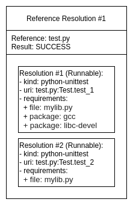
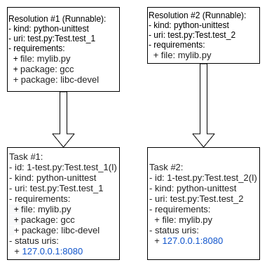
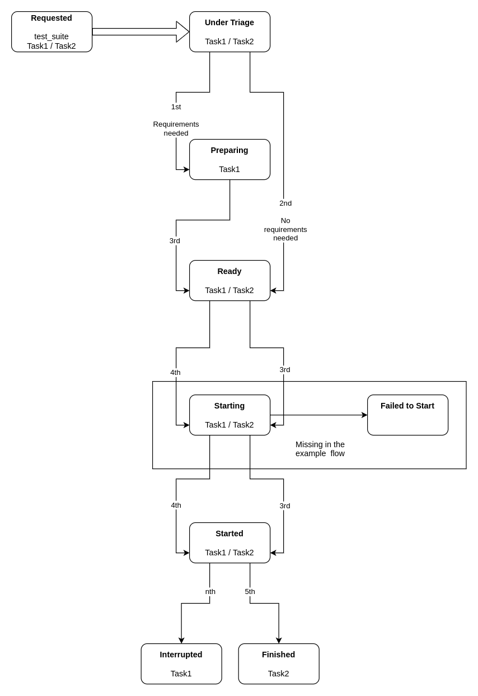

BP003
#####

:Number: BP003
:Title: N(ext)Runner Task Life-Cycle
:Author: Cleber Rosa <crosa@redhat.com>
:Discussions-To: avocado-devel@redhat.com
:Reviewers: Beraldo Leal <bleal@redhat.com>, Willian Rampazzo <willianr@redhat.com>
:Created: 20-July-2020
:Type: Architecture Blueprint
:Status: WIP

.. contents:: Table of Contents

TL;DR
*****

The N(ext) Runner has been used as Avocado's runner for selftests for
over a year.  The implementation used is based on the ``avocado nrun``
command, that is, outside of the Avocado's traditional ``avocado run``
entrypoint.  Under the hood, it means that the N(ext) Runner is not
integrated well enough with an Avocado Job.

A partial implementation of the N(ext) Runner integration with an
Avocado Job is available at ``avocado/plugins/runner_nrunner.py`` but
it has a number limitations.

The N(ext) Runner executes tests as :class:`Tasks
<avocado.core.nrunner.Task>`.  This blueprint describes the phases
that a Task can be in throughout its life-cycle, and how the handling
of these phases or states, will power the tests execution mechanism
within the context of an Avocado Job.

Motivations
***********

Propose an architecture for integrating the N(ext) Runner concepts and
features into an Avocado Job.  Because the N(ext) Runner contains
distinguishing features that the original Avocado Job did not
anticipate, a proxy layer is necessary.

The current runner (and Job) is built on the premises that there's a
"currently executing test", and thus, does not need to keep track of
various running tests states at once.  The N(ext) Runner, on the
other hand, support for running tests in parallel, and thus needs
supporting code for keeping track of their state and forward their
relevant information to an Avocado Job.

Goals of this BluePrint
***********************

1. Propose an architecture based on the life-cycle phases that an
   N(ext) Runner Task can go through while running under an Avocado
   Job.

2. Describe how the proposed architecture can power an implementation
   suitable for the next Avocado LTS release (82.0), having feature
   completeness when compared to the current runner, while still
   making its distinguishing features available to users who opt in.
   This also means that the current Avocado Job interface will
   continue to support the current runner implementation.

3. Prove that the current runner can be removed without significant
   user impact after the LTS release (within the 83.0 development
   cycle), based on the feature completeness of the N(ext) Runner
   with regards to its integration with an Avocado Job.

4. Allow for future extension of the Task life-cycle phases
   architecture, such as into a more capable and further reaching
   scheduler for Tasks.  This means that this BluePrint is focused
   on short term integration issues, as describe in the motivation,
   but at the same tries to not impose future limitations to have
   new features implemented for other use cases.

Requirements
************

This section describes the requirements to manage the Task's
life-cycle. It also describes the phases of a Task life-cycle and
includes an example.

Task Execution Requirements Verification
----------------------------------------

For a Task to actually be executed, there needs to be a minimal number
of requirements present.  For instance, it's pointless to attempt to
execute a Task of kind "custom" without either:

1. An ``avocado-runner-custom`` runner script that is compatible with
   the Avocado interface, OR

2. A ``CustomRunner`` runner class that is compatible with the
   :class:`avocado.core.nrunner.BaseRunner` interface

Other types of Task Execution Requirements checks may be added in the
future, but the core concept that a Task can not always be executed
remains.

Currently, as per the ``avocado nrun`` implementation, this
verification is done in a synchronous way, and it's of limited
visibility to the user.

Requirements:

1. The verification of one Task's requirement should not block other
   Tasks from progressing to other phases.

2. The user interface should provide more information on tasks that
   either failed the verification or that still going through the
   verification process.

Parallelization and Result Events
---------------------------------

The N(ext) Runner allows for the parallel execution of tasks.  When
integrated into a Job, it means there can be more than one test
running at a given time.

Currently, plugins that implement the
:class:`avocado.core.plugin_interfaces.ResultEvents` interface may
contain logic that assumes that the same test will have
``start_test``, ``test_progress`` and then ``end_test`` methods called
in that particular order, and only then another test will have any of
those called on its behalf.

For instance, the Human UI plugin will currently:

1. Print a line such as ``(1/1) /bin/true:`` when a test starts, that
   is, when
   :meth:`avocado.core.plugin_interfaces.ResultEvents.start_test` is
   called.

2. Add a throbber and/or change its state whenever a progress update
   is received, that is, when
   :meth:`avocado.core.plugin_interfaces.ResultEvents.test_progress`
   is called.

3. Add a test result such as ``PASS (0.01 s)`` when the test finishes,
   that is, when
   :meth:`avocado.core.plugin_interfaces.ResultEvents.end_test` is
   called.

Other implementations, such as the TAP result plugin, will only print
a line when the final test result is known.

Requirement: have no conflicts of test information when more than one
is running in parallel.

Requirement example: provide the test progress notification and the
final test result information "in line" with the correct test
indication (if given earlier).

.. note:: Ideally, this shouldn't require a change to the interface,
          but only within the implementation so that the presentation
          of coherent test result events is achieved.

Non-blocking Parallelization
----------------------------

As stated earlier, the N(ext) Runner allows for the parallel execution
of tasks.  A given Task should be allowed to be executed as early as
possible, provided:

1. Its requirements (such as its specific test runners) are available.

2. A limit for concurrently running tasks has not been reached.

Requirement: there should be no artificial and unnecessary blocking of
the parallelization level.

Requirement example: if an hypothetical Result Events plugin interacts
with a high latency server, and such interaction takes 2 minutes, the
execution of new tasks should not be affected by it.

.. note:: There are a number of strategies for concurrent programming
          in Python these days, and the "avocado nrun" command currently
          makes use of asyncio to have coroutines that spawn tasks and
          collect results concurrently (in a preemptive cooperative model).
          The actual tools/libraries used in the implementation shall be
          discussed later.

Passive Task Status Collection
------------------------------

The N(ext) Runner architecture allows tests to run in a much more
decoupled way, because of a number of its characteristics, including
the fact that Tasks communicate their status by sending asynchronous
messages.

.. note:: The current implementation uses network sockets as the
          transport for these messages, in part for its universal
          aspect, and in part to enforce this decoupling.  Future
          implementations may provide alternate transports, such
          as file descriptors, serial connections, etc.

There currently is a component used for a similar role used in
``avocado nrun``: :class:`avocado.core.nrunner.StatusServer`, but it
exceeds what's needed here in some aspects, and lacks in others
aspects.

Requirement: have a mechanism that can receive and collect in an
organized manner, all the state messages coming from tasks that are
part of an Avocado Job.

Requirement example: the Avocado Job should be able to use the
collection of task status information to ask questions such as
the following.

1. When was the last time that task "123-foobar" gave an status
   update?  Such information would be useful to determine if the task
   should be abandoned or destroyed as part of a timeout handling, as
   described in the later section about Task Monitoring and
   Termination.

2. Has the task "123-foobar" given a final status update?  That is,
   can we conclude that, as a Task, regardless of the success or
   failure of what it ran, it finished its execution?  Such information
   would be useful to post the final test result to the Job results and
   ``ResultEvent`` plugins, as described in the next section.

Proxy from Task Status To Job Result
------------------------------------

An Avocado Job contains an :class:`avocado.core.result.Result` which
tallies the overall job results.  But, the state messages coming from
Tasks are not suitable to being given directly to methods such as
:meth:`avocado.core.result.Result.check_state`.  A mechanism is needed
to proxy and convert the relevant message and events to the current
Avocado job result and ``ResultEvents`` plugins.

Requirements:

1. Proxy Task Status messages and convert them into the appropriate
   information suitable for :class:`avocado.core.result.Result`.

2. Allow :class:`ResultEvents
   <avocado.core.plugin_interfaces.ResultEvents>` plugins to act as
   soon as possible on relevant status messages;

Task Monitoring and Termination
-------------------------------

The N(ext) Runner architecture, as stated before, can have tasks
running without much, if any, contact with an Avocado Job.  But, an
Avocado Job must have a beginning and end, and with that it's
necessary to monitor tasks, and if their situation is not clear,
decide their fate.

For instance, a Task started as part of an Avocado Job may communicate
the following messages::

  {'status': 'started', 'time': 1596680574.8790667, 'output_dir': '/tmp/.avocado-task-d8w0k9s1', 'id': '1-/bin/sleep'}
  {'status': 'running', 'time': 1596680574.889258, 'id': '1-/bin/sleep'}

Then it may go offline for eternity.  The possible reasons are varied,
and despite them, the Job will eventually have to deal the non-final,
unknown state of tasks and given them a resolution.

.. Note:: The Spanwer may be able to provide additional information
          that will help to decide the handling given to such as Task
          (or its recorded final status).  For instance, if a Task
          running on a container is not communicating its status, and
          its verified that the container has finished its execution,
          it may be wise to not wait for the timeout.

Requirements:

1. Monitor the execution of a task (from an external PoV).

2. Unless it proves to be, say because of complexity or
   impossibilities when interacting with the spawners, tasks that are
   unresponsive should attempt to be terminated.

3. Notify the user if stray tasks should be clean up manually.  This
   may be, for instance, necessary if a Task on a container seems to
   be stuck, and the container can not be destroyed. The same applies
   to a process in an uninterruptible sleep state.

4. Update Job result with the information about monitored tasks.

 .. Note:: Tasks going through the usual phases will end up having
           their final state in the going through the task status
           collection described earlier, and from there have them
           proxied/converted into the Job result and plugins.  At
           first sight, it seems that the task monitoring should use
           the same repository of status and update it in a similar
           way, but on behalf of the "lost/exterminated task".

Suggested Terminology for the Task Phases
*****************************************

Task execution has been requested
---------------------------------

A Task whose execution was requested by the user. All of the tasks on a Job's
``test_suite`` attribute are requested tasks.

If a software component deals with this type of task, it's advisable that it
refers to ``TASK_REQUESTED`` or ``requested_tasks`` or a similar name that links
to this definition.

Task is being triaged
---------------------

The details of the task are being analyzed, including, and most
importantly, the ability of the system to run it. A task that leaves
triage, and it's either considered ``FINISHED`` because it can not be
executed, or is ``READY`` and waits to be executed.

If a software component deals with this type of task, for instance, if a "task
scheduler" is looking for runners matching the Task's kind, it should keep it
under a ``tasks_under_triage`` or mark the tasks as ``TASK_UNDER_TRIAGE`` or
``TASK_TRIAGING`` a similar name that links to this definition.

Task is ready to be started
---------------------------

Task has been triaged, and as much as the system knows, it's ready to
be executed.  A task may be in this phase for any amount of time, given
that the capacity to have an additional task started is dynamic and
may be enforced here.

If a software component deals with this type of task, it should keep
it under a ``tasks_ready`` or mark the tasks as ``TASK_READY`` or a
similar name that links to this definition.

Task has been started
---------------------

A task was successfully started by a spawner.

Note that it does *not* mean that the test that the task runner (say,
an ``avocado-runner-$kind task-run`` command) will run has already
started. This will be signaled by a runner, say
``avocado-runner-$kind`` producing an ``status: started`` kind of
status message.

If a software component deals with this type of task, it should keep
it under a ``tasks_started`` or mark the tasks as ``TASK_STARTED`` or
a similar name that links to this definition.

Task is finished
----------------

This means that there's no longer any activity or a new phase for this
task to move to.

It's expected that extra information will be available explaining
how/why the task arrived in this phase.  For instance, it may have
come from the ``TASK_TRIAGING`` phase and never gone through the
``TASK_STARTED`` phase.  Alternatively, it may been in the
``TASK_STARTED`` phase and finished without any errors.

It should be kept under a ``tasks_finished`` structure or be marked as
``TASK_FINISHED`` or a similar name that links to this definition.

.. note:: There's no associated meaning here about the pass/fail
          output of the test payload executed by the task.

Task life-cycle example
***********************

A task will usually be created from a Runnable. A Runnable will, in turn, almost
always be created as part of the "avocado.core.resolver" module. Let's consider
the following output of a resolution:

Two Runnables here will be transformed into Tasks. The process usually includes
adding an identification and a status URI:

In the end, a job will contain a ``test_suite`` with "Task #1" and "Task #2". It
means that the execution of both tasks was requested by the Job owner.

These tasks will now be triaged. A suitable implementation will move those tasks
to a ``tasks_under_triage`` queue, mark them as ``TASK_UNDER_TRIAGE`` or some other
strategy to differentiate the tasks at this stage.

Iteration I
-----------

Task #1 is selected on the first iteration, and it's found that:

1. A suitable runner for tasks of kind ``python-unittest`` exists;

2. The ``mylib.py`` requirement is already present on the current environment;

3. The ``gcc`` and ``libc-devel`` packages are not installed in the current
   environment;

Task #1 is not ready to be executed, so it's moved to
``TASK_FINISHED`` and it's reason is recorded.

No further action is performed on the first iteration because no other
relevant state exists (Task #2, the only other requested task, has not
progressed beyond its initial stage).

Iteration II
------------

On the second iteration, Task #2 is selected, and it's found that:

1. A suitable runner for tasks of kind ``python-unittest`` exists;

2. The ``mylib.py`` requirement is already present on the current environment.

Task #2 is now ready to be started.

As a reminder, Task #1 has not passed triaging and is ``TASK_FINISHED``.

Iteration III
-------------

On the third iteration, there are no tasks left under triage, so the action is
now limited to tasks being prepared and ready to be started.

.. Note:: As an optmization, supposing that the "status uri"
          127.0.0.1:8080, was set by the job, as its internal status
          server, it must be started before any task, to avoid any
          status message being lost.  Without such an optmization, the
          status server could be started earlier.

At this stage, Task #2 has been started.

Final Iteration
---------------

On the fifth iteration, the spawner reports that Task #2 is not alive anymore,
and the status server has received a message about it.

Because of that, Task #2 is now considered ``TASK_FINISHED``.

Tallying results
----------------

The nrunner plugin should be able to provide meaningful results to the Job, and
consequently, to the user, based on the resulting information on the final
iteration.

Notice that some information, such as the ``PASS`` for the second test,
will come from the "result" given in a status message from the task
itself. Some other status, such as the ``CANCEL`` status for the
first test will not come from a status message received, but from a
realization of the actual management of the task execution. It's
expected to other information will also have to be inferred, and
"filled in" by the nrunner plugin implementation.

In the end, it's expected that results similar to this would be presented::

    JOB ID     : f59bd40b8ac905864c4558dc02b6177d4f422ca3
    JOB LOG    : /home/cleber/avocado/job-results/job-2020-05-20T17.58-f59bd40/job.log
     (1/2) tests.py:Test.test_1: CANCEL (0 s)
     (1/2) tests.py:Test.test_2: PASS (2.56 s)
    RESULTS    : PASS 1 | ERROR 0 | FAIL 0 | SKIP 0 | WARN 0 | INTERRUPT 0 | CANCEL 1
    JOB TIME   : 0.19 s
    JOB HTML   : /home/cleber/avocado/job-results/job-2020-05-20T17.58-f59bd40/results.html

Notice that Task #2 may show up before Task #1.  There may be issues
associated with the current UI to deal with regarding out of order
task status updates.

Implementation Example
**********************

The following implementation example uses random sleeps and random
(but biased) results from operations expected to happen on different
phases, to simulate the behavior of real tasks.

The enforcement of some artifical limits (such as the number of tasks
``TASK_STARTED``) is also exemplified.  As a general rule, all tasks
are attempted to be moved further into their life-cycle and a number
of "workers" doing that should not conflict with each other.

This implementation uses Python's :mod:`asyncio` library very crudely.
The final implementation may use other tools, such as a
:class:`asyncio.Queue` instead of plain lists with a
:class:`asyncio.Lock`.  It may also use individual :class:`Tasks
<asyncio.Task>` for each work in each phase.

.. literalinclude:: ../../../examples/nrunner/task-state-machine.py

Backwards Compatibility
***********************

The compatibility of the resulting Job compatible runner
implementation with the current runner is to be verified by running
the same set of "Job API feature tests", but with this runner selected
instead.

There are no compatibility issues with the previous versions of
itself, or with the non-Job compatible ``nrun`` implementation.

Security Implications
*********************

None that we can determine at this point.

How to Teach This
*****************

The distinctive features that the N(ext) Runner provides should be
properly documented.

Users should not be required to learn about the N(ext) Runner features
to use it just as an alternative to the current runner implementation.

Related Issues
**************

Current issues that are expected to be solved when this blueprint is
implemented:

#. Have a passive Task Status collection server implementation.

#. Have a Task Life Cycle / State Machine implementation.

#. Have Spawner features to check the status (alive or not) for Tasks.
   This is inteded to be used in place or in addition of the status
   messages from Tasks, when they failed to be generated by tasks
   or received by the Task Status collection server.

#. Have Spawner features to destroy (best effort) stray Tasks.

#. Fully integrate the N(ext) Runner into the Avocado Job and command
   line app, that is, as a general rule all features of the current
   runner should be present when the N(ext) Runner is used in a job.

Future work
***********

These are possible future improvements to the Task phases, and may be
a partial list of addition towards a more comprehensive "Task
scheduler".  They are provided for discussion only and do not
constitute hard requirements for this or future work.

Tasks' requirements fulfilment
------------------------------

1. Prepare for the execution of a task, such as the fulfillment of extra task
requirements. The requirements resolver is one, if not the only way,
component that should be given a chance to act here;

2. Executes a task in a prepared environment;

Active Task Status Collection
-----------------------------

Some environments and use cases may require disconnected execution
of tasks.  In such cases, a Job will have to activelly poll for
tasks' statuses, which may be:

1. an operation that happens along the task execution.

2. only at the end of the task execution, as signalled by the
   termination of the environment in which a task is running on.

References
**********

 * RFC: https://www.redhat.com/archives/avocado-devel/2020-May/msg00015.html
 * Early implementation: https://github.com/avocado-framework/avocado/pull/3765
 * Requirement check prototype: https://github.com/avocado-framework/avocado/pull/4015
