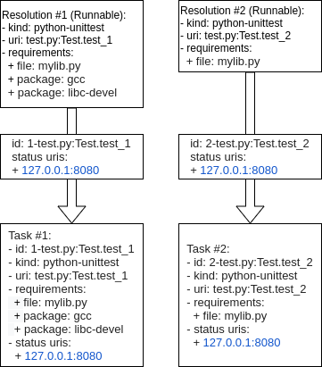

BP003
#####

:Number: BP003
:Title: N(ext)Runner Task Scheduler
:Author: Cleber Rosa <crosa@redhat.com>
:Discussions-To: avocado-devel@redhat.com
:Reviewers:
:Created: 20-July-2020
:Type: Architecture Blueprint
:Status: Draft

.. contents:: Table of Contents

TL;DR
*****

The N(ext) Runner has been used as Avocado's runner for selftests for
over a year, but that has been implemented as ``avocado nrun``, that
is, outside of the Avocado's traditional ``avocado run`` entrypoint.
Under the hood, it means that the N(ext) Runner is not well integrated
enough to an Avocado Job.

A partial implementation of the N(ext) Runner integration to an
Avocado Job is available at ``avocado/plugins/runner_nrunner.py`` but
it has many limitations.  This blueprint describes the architecture of
a scheduler that will power this Job compatible N(ext) Runner
implementation.

Motivation
**********

Describe the architecture of an task scheduler that will power the Job
compatible N(ext) Runner implementation, allowing the N(ext) Runner
first supported version to achieve feature completeness, and replace
the current runner soon after the next LTS version is released.

Specification
*************

Task execution coordination goals
---------------------------------

For an Avocado job to be useful with the N(ext) Runner architecture,
tasks must be executed. Differently then the current runner, the
N(ext) Runner architecture allows those to be executed in a much more
decoupled way. This characteristic will be maintained, but it needs to
be adapted into the current Job execution.

From a high-level view, the nrunner plugin needs to:

1. Break apart from the "one at a time" Task execution model that it currently
   employs;

2. Check if a Tasks can be executed, that is, if its requirements can be
   fulfilled (the most basic requirement for a task is a matching runner);

3. Prepare for the execution of a task, such as the fulfillment of extra task
   requirements. The requirements resolver is one, if not the only way,
   component that should be given a chance to act here;

4. Executes a task in a prepared environment;

5. Monitor the execution of a task (from an external PoV);

6. Collect the status messages that tasks will send;

  a. Forward the status messages to the appropriate job components, such as the
  result plugins.

  b. Depending on the content of messages, such as the ones containing "status:
  started" or "status: finished", interfere in the Task execution status, and
  consequently, in the Job execution status.

7. Verify, warn the user, and attempt to clean up stray tasks. This may be, for
   instance, necessary if a Task on a container seems to be stuck, and the
   container can not be destroyed. The same applies to the process in some time
   of uninterruptible periods of sleep.

Parallelization
---------------

Because the N(ext) Runner features allow for parallel execution of tasks, all
other aspects of task execution coordination (fulfilling requirements,
collecting results, etc.) should not block each other.

There are a number of strategies for concurrent programming in Python these
days, and the "avocado nrun" command currently makes use of asyncio to have
coroutines that spawn tasks and collect results concurrently (in a preemptive
cooperative model). The actual language or library features used is, IMO, less
important than the end result.

Suggested terminology
---------------------

Task execution has been requested
~~~~~~~~~~~~~~~~~~~~~~~~~~~~~~~~~

A Task whose execution was requested by the user. All of the tasks on a Job's
``test_suite`` attribute are requested tasks.

If a software component deals with this type of task, it's advisable that it
refers to ``TASK_REQUESTED`` or ``requested_tasks`` or a similar name that links
to this definition.

Task is being triaged
~~~~~~~~~~~~~~~~~~~~~

The details of the task are being analyzed, including, and most importantly,
the ability of the system to *attempt* to fulfill its requirements. A task
leaves triage, and it's either considered "discarded" or proceeds to be prepared
and then executed.

If a software component deals with this type of task, for instance, if a "task
scheduler" is looking for runners matching the Task's kind, it should keep it
under a ``tasks_under_triage`` or mark the tasks as ``UNDER_TRIAGE`` or
``TRIAGING`` a similar name that links to this definition.

Task is being prepared
~~~~~~~~~~~~~~~~~~~~~~

Task has left triage, and it has not been discarded, that is, it's a candidate
to be set up, and if it goes well, executed.

The requirements for a task are being prepared in its respective isolation
model/execution environment, that is, the spawner it'll be executed with is
known. The setup actions will be visible by the task.

If a software component deals with this type of task, for instance, the
implementation of the resolution of specific requirements, it should keep it
under a ``tasks_preparing`` or mark the tasks as ``PREPARING`` or a similar name
that links to this definition.

Task is ready to be started
~~~~~~~~~~~~~~~~~~~~~~~~~~~

Task has been prepared successfully, and can now be executed.

If a software component deals with this type of task, it should keep it under a
``tasks_ready`` or mark the tasks as ``READY`` or a similar name that links to
this definition.

Task is being started
~~~~~~~~~~~~~~~~~~~~~

A hopefully short lived state, in which a task that is ready to be started (see
previous point) will be given to the reespective spawner to be started.

If a software component deals with this type of task, it should keep it under a
``tasks_starting`` or mark the tasks as ``STARTING`` or a similar name that
links to this definition.

The spawner should know if the starting of the task succeeded or failed, and the
task should be categorized accordingly.

Task has been started
~~~~~~~~~~~~~~~~~~~~~

A task was successfully started by a spawner.

Note that it does *not* mean that the test that the task runner (say, an
"avocado-runner-$kind task-run" command) will run has already started. This will
be signaled by a "status: started" kind of message.

If a software component deals with this type of task, it should keep it under a
``tasks_started`` or mark the tasks as ``STARTED`` or a similar name that links
to this definition.

Task has failed to start
~~~~~~~~~~~~~~~~~~~~~~~~

Quite self-explanatory. If the spawner failed to start a task, it should be kept
under a ``tasks_failed_to_start`` structure or be marked as ``FAILED_TO_START``
or a similar name that links to this definition.

Task is finished
~~~~~~~~~~~~~~~~

This means that the task has started and is now finished. There's no associated
meaning here about the pass/fail output of the test payload executed by the
task.

It should be kept under a ``tasks_finished`` structure or be marked as
``FINISHED`` or a similar name that links to this definition.

Task has been interrupted
~~~~~~~~~~~~~~~~~~~~~~~~~

This means that the task has started but has not finished, and it's past due.

It should be kept under a ``tasks_interrupted`` structure or be marked as
``INTERRUPTED`` or a similar name that links to this definition.

Task workflow
-------------

A task will usually be created from a Runnable. A Runnable will, in turn, almost
always be created as part of the "avocado.core.resolver" module. Let's consider
the following output of a resolution:

.. image:: images/BP003/Resolution.png
   :width: 200
   :alt: Test resolution

Two Runnables here will be transformed into Tasks. The process usually includes
adding an identification (I) and a status URI (II):

In the end, a job will contain a ``test_suite`` with "Task #1" and "Task #2". It
means that the execution of both tasks was requested by the Job owner.

These tasks will now be triaged. A suitable implementation will move those tasks
to a ``tasks_under_triage`` queue, mark them as ``UNDER_TRIAGE`` or some other
strategy to differentiate the tasks at this stage.

.. image:: images/BP003/Task-scheduler-flow.png
   :width: 800
   :alt: Task scheduler flow

Iteration I
~~~~~~~~~~~

Task #1 is selected on the first iteration, and it's found that:

1. A suitable runner for tasks of kind ``python-unittest`` exists;

2. The ``mylib.py`` requirement is already present on the current environment;

3. The ``gcc`` and ``libc-devel`` packages are not installed in the current
   environment;

4. The system is capable of *attempting* to fulfill "package" types of
   requirements.

Task #1 will then be prepared. No further action is performed on the first
iteration because no other relevant state exists (Task #2, the only other
requested task, has not progressed beyond its initial stage).

Iteration II
~~~~~~~~~~~~

On the second iteration, Task #2 is selected, and it's found that:

1. A suitable runner for tasks of kind ``python-unittest`` exists;

2. The ``mylib.py`` requirement is already present on the current environment.

Task #2 is now ready to be started. Possibly concurrently, the setup of Task #1,
selected as the single entry being prepared, is having its requirements
prepared.

Iteration III
~~~~~~~~~~~~~

On the third iteration, there are no tasks left under triage, so the action is
now limited to tasks being prepared and ready to be started.

Supposing that the "status uri" 127.0.0.1:8080, was set by the job, as its
internal status server, it must be started before any task, to avoid any status
message being lost.

At this stage, Task #2 is started, and Task #1 is now ready.

Iteration IV
~~~~~~~~~~~~

On the fourth iteration, Task #1 is started.

Note: the ideal level of parallelization is still to be defined, that is, it may
be that triaging and preparing and starting tasks, all run concurrently. An
initial implementation that, on each iteration, looks at all Task states, and
attempts to advance them further, blocking other Tasks as much as little as
possible should be acceptable.

Iteration V
~~~~~~~~~~~

On the fifth iteration, the spawner reports that Task #2 is not alive anymore,
and the status server has received a message about it (and also a message about
Task #1 having started).

Because of that, Task #2 is now considered ``FINISHED``.

And Task #1 is still a ``STARTED`` task.

Final Iteration
~~~~~~~~~~~~~~~

After several iterations with no status changes, and because of a timeout
implementation at the job level, it's decided that Task #1 is not to be waited
on.

The spawner continues to inform that Task #1 is alive (from its PoV), but no
further status message has been received. Provided the spawner has support for
that, it may attempt to clean up the task (such as destroying a container or
killing a process). In the end, it's left with.

Tallying results
~~~~~~~~~~~~~~~~

The nrunner plugin should be able to provide meaningful results to the Job, and
consequently, to the user, based on the resulting information on the final
iteration.

Notice that some information will come, such as the ``PASS`` for the first test,
will come from the "result" given in a status message from the task itself. Some
other status, such as the ``INTERRUPTED`` status for the second test will not
come from a status message received, but from a realization of the actual
management of the task execution. It's expected to other information will also
have to be inferred, and "filled in" by the nrunner plugin implementation.

In the end, it's expected that results similar to this would be presented::

    JOB ID     : f59bd40b8ac905864c4558dc02b6177d4f422ca3
    JOB LOG    : /home/cleber/avocado/job-results/job-2020-05-20T17.58-f59bd40/job.log
     (1/2) tests.py:Test.test_2: PASS (2.56 s)
     (2/2) tests.py:Test.test_1: INTERRUPT (900 s)
    RESULTS    : PASS 1 | ERROR 0 | FAIL 0 | SKIP 0 | WARN 0 | INTERRUPT 1 | CANCEL 0
    JOB TIME   : 0.19 s
    JOB HTML   : /home/cleber/avocado/job-results/job-2020-05-20T17.58-f59bd40/results.html

Notice how Task #2 shows up before Task #1 because it was both started first and
finished earlier. There may be issues associated with the current UI to deal
with regarding out of order task status updates.

Backwards Compatibility
***********************

The compatibility of the resulting Job compatible runner
implementation with the current runner is to be verified by running
the same set of "Job API feature tests", but with this runner selected
instead.

There are no compatibility issues with the previous versions of
itself, or with the non-Job compatible ``nrun`` implementation.

Security Implications
*********************

None that we can determine at this point.

How to Teach This
*****************

The distinctive features that the N(ext) Runner provides should be
properly documented.

Users should not be required to learn about the N(ext) Runner features
to use it just as an alternative to the current runner implementation.

Related Issues
**************

Here's a list of all issues related to this blueprint:

 * https://github.com/avocado-framework/avocado/issues?q=is%3Aopen+is%3Aissue+label%3Anrun2run

References
**********

 * RFC: https://www.redhat.com/archives/avocado-devel/2020-May/msg00015.html
 * Early implementation: https://github.com/avocado-framework/avocado/pull/3765
 * Requirement check prototype: https://github.com/avocado-framework/avocado/pull/4015
