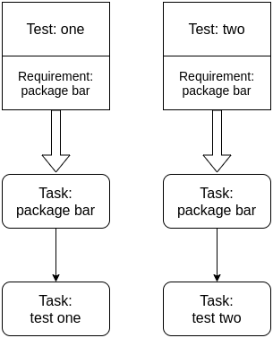
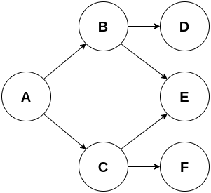
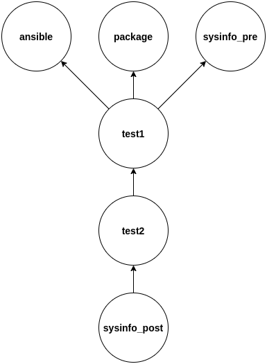

BP004
#####

:Number: BP004
:Title: Dependency graph
:Author: Willian Rampazzo <willianr@redhat.com>
:Discussions-To: https://github.com/avocado-framework/avocado/pull/5125
:Reviewers: Ana Guerrero Lopez <anguerre@redhat.com>, Beraldo Leal <bleal@redhat.com>, Cleber Rosa <crosa@redhat.com>, Jan Richter <jarichte@redhat.com>
:Created: 21-Oct-2021
:Type: Architecture Blueprint
:Status: Approved

.. contents:: Table of Contents

TL;DR
*****

The current implementation of the Requirement Resolver handles requirements individually for each test. When two different tests depend on the same requirement, each is resolved separately, creating two different tasks. Each duplicated requirement task runs before each of the tests depending on them. This is not desired as the requirements tasks may conflict.

This blueprint proposes to expand the Requirements Resolver to a Dependency Graph architecture, where the resolution of the same requirement for multiple tests, in the same environment, creates one requirement task and makes all the tests tasks depend on it. This mechanism also allows complex dependency structures, like pre and post dependency tasks.

Motivation
**********

The current implementation of the Requirements Resolver (see BP002) handles each test with its requirements separately. When multiple tests have the same requirement, the Requirements Resolver creates one requirement task for each test.

This behavior is not desired and can cause problems. For example, two requirement tasks running the same package installation in the same environment waste one task cycle in the state machine, checking if the package installation happened correctly. Another example, two requirement tasks downloading the same remote file in the same environment may download the file twice. The diagram below illustrates the current behavior.

The straightforward solution to this problem is to identify the same requirement for multiple tests in the same environment and create one single task for this requirement. This solution is limited to tests and their requirements. Another idea, and the proposal of this blueprint, is to expand the Requirements Resolver to a Dependency Graph.

A dependency graph is a directed acyclic graph describing the dependencies between the nodes. In a dependency graph, each arc of a node connects to the node on which it depends. The diagram below illustrates a dependency graph:

In the example above, node A depends on nodes B and C; node B depends on nodes D and E; node C depends on nodes E and F. Nodes D, E and F are the independent nodes and take the initial positions. A dependency graph may have multiple topological orders. Some valid topological orders for the graph above are:

1. A, C, B, F, E, D;

2. A, C, F, B, E, D;

3. A, B, D, C, F, E.

The inverse topological order represents the execution order for the tasks, where independent nodes can execute in parallel. The algorithm to create the topological order removes the source nodes (those nodes with in-degree equal to zero) while enumerating them. With the removal of a source node, new source nodes may be created. The algorithm ends when there are no more nodes to remove, meaning the graph is empty or the remaining nodes are not sources. In the latter case, the graph has cycles and cannot be handled as a dependency graph.

A dependency graph allows the construction and control of more elaborated structures representing the dependencies between the tests, requirements, and others. One example covered by the dependency graph is a test depending on a plugin, like SysInfo, which can run before and after a test or before and after a job.

What is not covered by the Dependency Graphs
============================================

The main objective of the dependency graph is to solve the problem where two tasks depending on the same requirement, in the same environment, create two different requirements tasks that may conflict.

What this blueprint does not solve is how the dependencies, after fulfilled, are cached in each kind of environment. For example, when two different tests have the same dependency and run inside a container, it is the caching system responsibility to cache that state of the container and pass it to the tests before they run.

Specification
*************

On the default runner, the requirements resolution happens during the creation of the test task. The nrunner runner plugin creates a requirement task when a test has a requirement listed on its structure and sets the new test task to depend on this requirement task. As mentioned, different tests with the same requirement will depend on different requirements tasks that perform the same activity. See `runner_nrunner.py#L207 <https://github.com/avocado-framework/avocado/blob/09221f33ac2ff974a076f93601e8bd7fd6738e7a/avocado/plugins/runner_nrunner.py#L207>`__ for more details on how it happens.

Dependency representation
=========================

This section describes how to represent a dependency graph in a way that Avocado can use.

Current representations from BP002
----------------------------------

The current implementation for representing the requirements of a test uses the test docstring. There are other representations for requirements specified in the Requirements Resolver blueprint (`BP002 <https://avocado-framework.readthedocs.io/en/latest/blueprints/BP002.html>`__), like JSON and Python executable that produces a JSON file, but those are still not implemented.

Adjusting the terminology
-------------------------

When a test has a requirement, the test task depends on the requirement task. When the execution of the requirement task fails, the test is skipped.

On a dependency graph, a test task may depend on a requirement task, meaning the requirement needs to be fulfilled and the task complete with success before the test task starts. Also, the test task may require another task to run after it finishes. In this case, a dependency task running after the test task may not impact the status of the test run.

By definition, a requirement is "something essential to the existence or occurrence of something else". Having a requirement that should be fulfilled after a test task may confuse.

To adjust the terminology related to representations, the proposal is renaming the "requirement" tag to "dependency".

The "dependency" word has a high-level meaning and is less misinterpreted when compared to "requirement". The idea is not to use a strict math definition of a dependency relation, but a soft meaning where after one task runs, another should run, and the second cannot start if the first has not finished.

Extending representations from BP002
------------------------------------

The proposal is to extend the representations defined at BP002, adding a parameter to state when a dependency should be satisfied.

This parameter is expressed as a list of stages supported by the dependency graph. Initially, the 'pre' and 'post' stages are supported, meaning a task should run before or after the given test.

The 'stage' parameter is optional and has the 'pre' value as default to remove the extra work on the user side. The user overwrites the parameter by adding it to the dependency definition.

The behavior when a 'pre' stage task fails is skipping the test depending on it. If a task fails while running in the 'post' stage, it doesn't make sense to skip a test that already ran or mark it as failed. The proposed behavior is to keep the success state of the test and log the failure of the 'post' stage task. This may need a mechanism to allow failure of a task.

The following example represents the use of the additional parameter 'stage' to the JSON representation::

	[
		{"type": "file", "uri": "https://cabort.com/cabort.c", "hash": "deadbeefdeadbeef", "stage": "pre"},
		{"type": "sysinfo", "stage": "['pre', 'post']"},
		{"type": "ansible", "stage": "['post']"},
	]

The representation above should be considered a didactic example, as plugins, like 'sysinfo' may have the 'pre' and 'post' stages set as default to reduce the user's extra work of adding it every time the plugin is used.

The same approach of adding a new parameter 'stage' to the dependency specification applies to other representation formats.

One limitation of this representation is to restrict the definition of dependencies to the test definitions.

Represent the dependency graph using DOT files
----------------------------------------------

DOT is a powerful graph description language. It is possible to use its digraph description to represent dependencies between tasks. With the DOT digraph description on Avocado, the nodes represent runnables, like test references or requirements, and arcs represent the dependencies.

The support for DOT on Python is available thru third-party libraries, like `Graphviz <https://github.com/xflr6/graphviz>`__ and `pydot <https://github.com/pydot/pydot>`__. Avocado can benefit from those libraries while handling DOT files. Still, as it adds a package dependency to the project, the proposal adds the support for DOT files as an optional plugin.

Following is the DOT description of the same graph shown in section "Motivation"::

    digraph G {
        A -> B;
        B -> D;
        B -> E;
        A -> C;
        C -> E;
        C -> F;
    }

In a DOT description, the nodes are defined with any representation, like strings, for example. Avocado can translate the node information into a task and set the dependencies. Following is an example of a valid DOT description.::

    digraph G {
        "ansible": "{'type': 'ansible', 'stage': 'pre'}";
        "package": "{'type': 'package', 'name': 'lvm'}";
        "test1": "{'type': 'test', 'reference': 'examples/tests/passtest.py:PassTest.test'}";
        "test2": "{'type': 'test', 'reference': 'examples/tests/sleeptest.py:SleepTest.test'}";
        "sysinfo_pre": "{'type': 'sysinfo', 'stage': 'pre'}";
        "sysinfo_post": "{'type': 'sysinfo', 'stage': 'post'}";

        sysinfo_post -> test2;
        test2 -> test1;
        test1 -> sysinfo_pre;
        test1 -> package;
        test1 -> ansible;
    }

The Avocado optional plugin can use this description to represent the graph dependency of tasks. The image below depicts the DOT description above.

High-level workflow
===================

The current workflow needs some adjustments to support a workflow using the dependency graph. In the current implementation, the dependency of tasks is set during the test task creation process. During the test task creation, the code inspects for test requirements and starts a new process of requirements tasks creation. The output of this process is a list of tasks that serves as the input for the state machine.

In the current workflow, there is a direct and restricted link between a test and its requirements, meaning that the tests are not aware of the requirements of other tests. This is one of the causes of multiple requirements tasks related to different tests trying to fulfill the same requirement.

In a workflow considering a dependency graph, ideally, data structures related to all types of runnable should be available before creating the dependency graph. This way, the duplication of tasks for the same activity (like a requirement fulfillment) is avoided. One key factor in avoiding unneeded duplication of tasks is making the structure representing the runnable comparable.

After all the data structures related to the runnables are available, the dependency graph can be built and also the topological order.

The state machine will handle the same list of tasks, but this time in topological order.

Internal representation
=======================

There are two ways of representing the dependency graph: implicit, using the structures already available, or explicit, creating a new graph structure.

In an implicit representation, the graph arcs are defined in the runnable overlay as a doubly linked list. It is necessary to evaluate whether the doubly linked list should be part of the runnable structure, the task structure, or the runtime task structure.

The advantage of this approach is that the dependency information is within the object (the runnable, task, or runtime task object). The disadvantage of this approach is that all the objects should be consulted to discover the graph structure and change it.

In an explicit representation, the graph is represented in a new data structure. It can be an adjacency matrix or an adjacency list. Considering the sparsity of graphs dealt with here, the adjacency list structure should be a better choice.

The advantage of an explicit representation is that the information about the graph structure is straightforward. One more data structure to handle may be considered a disadvantage, but the benefits outweigh the disadvantages.

Backward Compatibility
***********************

This blueprint proposes a new feature. When it is not used, it will not affect the current behavior of the execution of the tests.

As this blueprint extends the Requirements Resolver, the current behavior of a requirement is not changed.

Security Implications
*********************

As far as analyzed, this feature does not introduce new security implications.

It is important to note that the security implication described on BP002 for Python executable to build the requirements file is also valid in this blueprint.

How to Teach This
*****************

One of the steps in developing this feature, and as soon as it replaces the current Requirements Resolver, should be to extend the `documentation <https://avocado      -framework.readthedocs.io/en/latest/guides/user/chapters/requirements.html>`__.

The addition of more complex examples is another way to spread the new feature.

Related Issues
**************

Here is a list of all issues related to this blueprint:

#. `[OPEN] <https://github.com/avocado-framework/avocado/issues/5169>`__ [Dependency Graph] Track the development of the dependency graph
#. `[OPEN] <https://github.com/avocado-framework/avocado/issues/4620>`__
   Functional test for requirements resolver fails easily

References
**********
